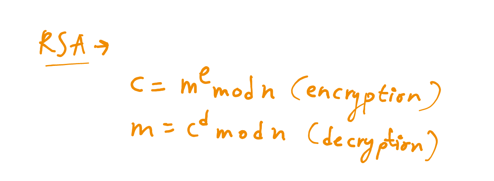
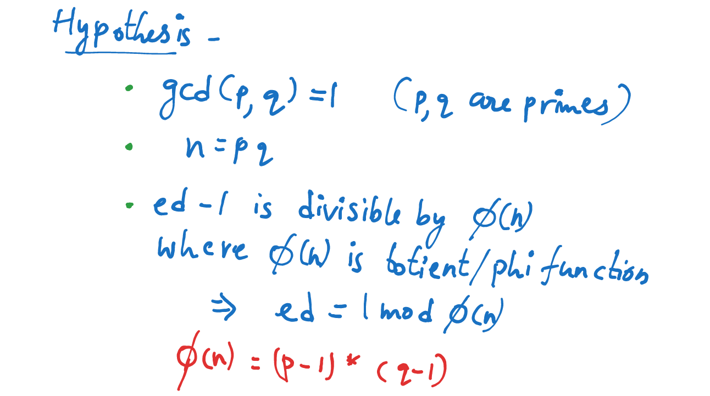

# Cryptography_WEC

My solutions to WEC Crypto recs

## Stage-1

So this stage was to use ceaser cipher/ rotation cipher.
The given encrypted text was YZH(878GBC 8BFC87 8C7999 F8AFB ADA8GG 8GGCC7 A7F9EG 8BFDAB)

My goto website for any ceaser cipher is cachesleuth multidecoder,when I checked for all the rotations at rotation 7 the text was something RSA(....
so it was something related to RSA. As RSA deals with only numbers we need to add even numbers in the rotation array.
So I made my own python code to do that

(We can also see that G is 7th from start and subtraction will result in Z in alphs but 9 in nums!!)
(dcode is also a very good website for ciphers)

The final decrypted text is - RSA(101945 148510 150222 81384 363199 199550 308279 148634)

## Stage-2

In this stage they gave us the pub key of the encryptor as here n is small we can easily find its prime factors (p,q). I always check in factor database if it's already factorised or not. As n is small we can also use sympy to find factors.
Here are few text I wrote on how messages are encrypted & decrypted in RSA:

So using this I wrote a python code to decrypt the ciphertext
(I initially thought that ciphertext was the combination of all ints and wasted my time)

The password is - 9135 5700 6382 9648 7286 4198 1686 3054

## Stage-3

This stage was pretty interesting. I took some time to figure out what was happening in encrypt.c and reverse it.

text[0] * key[0] % 10000 = encrypted[0]
(text[i] * key[i]) - encrypted[i-1] % 10000 = encrypted[i]

We can generalise that:
(text[i] * key[i]) = 10000k - encrypted[i] + encrypted[i-1]

We can restrict our range of the product from 33^2 to 125^2 as chars of those are printable.
Now we can write a python code for this.

We get the products array as - [9135, 6565, 10682, 3266, 7638, 6912, 7488, 1368]

Now restricting text[i] and key[i] in 33,125 we can find the possible text[i] and key[i] values.
After getting the multiples we can find all the possible strings of text and keys.
We can now bruteforce all the possible passwords, I used python to do that.

(I'm really sorry as I used other libraries)

Now we get the password as - iAmGr@@t

(In stage-2 the key was already given lmao xD)

Overall I enjoyed doing this and learned many stuffs :)
(I took 4-5hrs to solve the whole challenge from stage-1 to 3 and this writing took other 2hrs lol)
